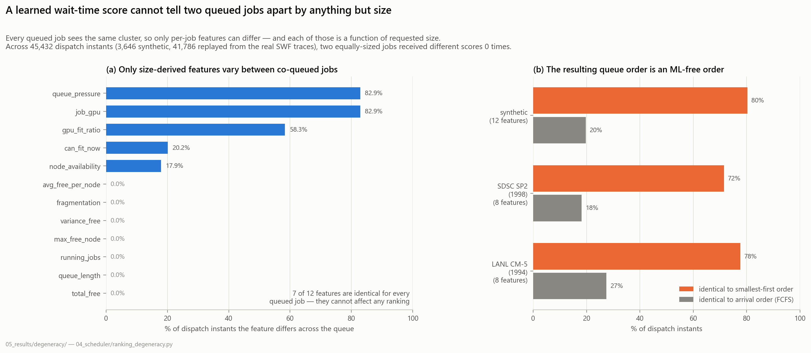
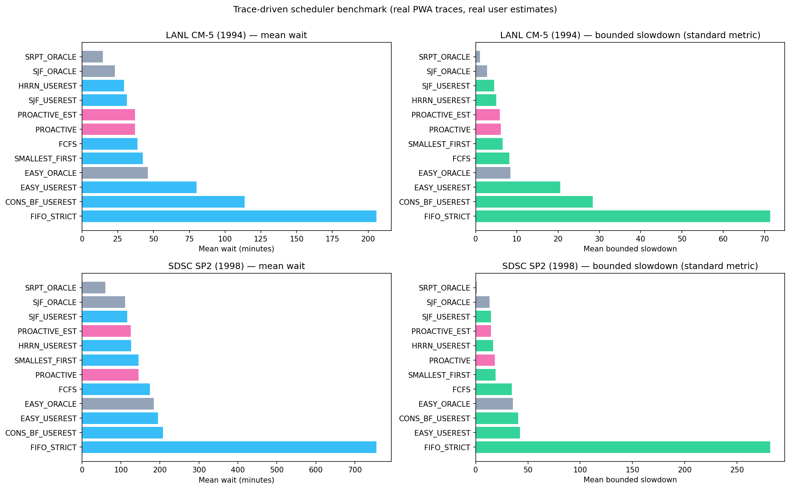

<div align="center">

# Proactive Feasibility Scheduler

**An evaluation study of ML-based job scheduling — and a negative result.**

[](LICENSE)
[](https://www.python.org/)
[](https://github.com/rakshit-737/proactive-feasibility-scheduler/actions/workflows/ci.yml)
[](README_REPRODUCIBILITY.md)

[Methodology](METHODOLOGY.md) ·
[Results](RESULTS.md) ·
[Manuscript](phases_22_30/phase_28_manuscript/manuscript.tex) ·
[Reproducibility](README_REPRODUCIBILITY.md) ·
[Deployment](DEPLOYMENT.md) ·
[Documentation](docs/explanation.html)

</div>

---

> **Headline (v3.6).** Using a learned wait-time regressor to order a scheduling
> queue is *structurally degenerate*. At any dispatch instant every queued job
> sees the same cluster, so only the job's own features differ — and in the
> standard cluster-state feature set every one of those is a deterministic
> function of the job's requested size. The learned score is therefore a
> function of requested size alone. Verified over **45,432 dispatch instants
> with zero counterexamples** — 41,786 of them replayed from two real traces,
> 3,646 from the synthetic generator: two equally-sized queued jobs *never*
> receive different scores, and 7 of the 12 features vary across the queue in
> **0.0%** of instants (every feature that does vary is itself a function of
> size). Consequently a one-line `sort by requested size` is statistically
> **equivalent** to the full XGBoost pipeline (paired TOST p = 2.6e-16), an MLP
> over the same features reproduces that sort *bit-identically*, and the
> synthetic 7.9% gain over FCFS does not replicate on real traces.
>
> See [`04_scheduler/ranking_degeneracy.py`](04_scheduler/ranking_degeneracy.py)
> and [the manuscript](phases_22_30/phase_28_manuscript/manuscript.tex).

<picture>
  <source media="(prefers-color-scheme: dark)" srcset="05_results/degeneracy/ranking_degeneracy-dark.png">
  
</picture>

### Why the score can only see job size

At a dispatch instant the cluster state is the **same for every queued job**, so it
cannot separate any two of them. What is left are the per-job features — and given
the state, each one is a deterministic function of the requested size `g`:

```
can_fit_now        = 1[ free(S) >= g ]
gpu_fit_ratio      = min( free(S) / g , 1 )
node_availability  = |{ n : free_n(S) >= g }| / N
queue_pressure     = ( Σ_queue − g ) / ( free(S) + 1 )
```

So the learned score is `ŵ(job | S) = g_S(size)` — a per-instant **lookup table from
requested size to priority**. The remaining **seven** features describe only the
cluster, so they choose *which* table is used but can never distinguish two jobs
inside one. And a ranking consumes nothing else. (`queue_pressure` differs between
co-queued jobs only through its `−g` term, so it is also just a function of size.)

The honest control is therefore not FIFO — it is *sorting by requested size*, which
needs no dataset, no training, no inference, no SHAP explanation and no drift monitor.

## Quick start
```bash
pip install -r requirements.txt
bash run_all_experiments.sh
```
The pipeline bootstraps itself: step 0 of `run_all_experiments.sh` regenerates `02_data/improved_wait_dataset.csv` and trains `03_models/wait_model_v2.pkl` before any analysis runs, so a fresh checkout works end-to-end. The script is a single 22-step run that regenerates **every** committed result — including the three v3.6 additions: the split-protocol comparison (`03_models/evaluate_splits.py`), the equivalence-power analysis (`04_scheduler/tost_power.py`) and the censoring audit (`04_scheduler/censoring_analysis.py`) — and `python tools/verify_artifacts.py` (`--quick` / `--smoke`) re-checks the artefacts afterwards. `requirements.txt` includes every dependency the scripts import.

Just the headline experiments:
```bash
cd 04_scheduler
python ranking_degeneracy.py        # the degeneracy result (45,432 instants)
python trace_driven_benchmark.py    # 12 policies x 2 real traces x 20 windows
python multi_scheduler_benchmark.py # 14-scheduler synthetic study + TOST
```

## Key features (v3.6)
- **Ranking-degeneracy diagnostic** (since v3.4): instruments real dispatch decisions to test whether a learned wait-time score can distinguish co-queued jobs at all, and recovers the size→priority lookup table the model collapses to
- **Trace-driven scheduler benchmark** (since v3.4): event-driven, second-exact replay of two real Parallel Workloads Archive traces through 12 policies, using the **real user runtime estimates the traces contain** instead of a simulated estimate model
- **Equivalence testing** (since v3.4): paired TOST throughout, so "these two policies perform the same" is a positive finding rather than a failure to reject
- **14-scheduler synthetic benchmark**: FCFS/first-fit, strict FIFO, SJF (oracle / f-model estimate), static priority, HRRN, **Smallest-first (the ML-free control)**, canonical EASY backfill (oracle + estimates), conservative backfill, preemptive SRPT, Proactive, NN, predicted-wait backfill hybrid — Holm-adjusted pairwise significance plus an estimate-quality sweep. The SJF-modal variant quoted below is not one of the 14 benchmark rows; it comes from that sweep (`05_results/schedulers/estimate_sensitivity_summary.csv`)
- 30-phase research pipeline (simulation, ML, benchmarking, robustness, explainability, statistics, OOD, fairness/SLA, deployment) — the ROI phase is **withdrawn** in v3.6, not caveated; see *Corrections in v3.6* below
- Bounded-fairness wait-budget (Pareto-swept); uncertainty-aware scheduling study
- Scaling analysis, online learning, concept drift adaptation
- Reproducibility kit (shell script + Docker + requirements)
- Interactive dashboard (`dashboard.py`) and GitHub Pages docs (`docs/`)

## The result, in three numbers

| | | |
|---|---|---|
| **0** | counterexamples in **45,432** dispatch instants (41,786 real + 3,646 synthetic) | two equally-sized queued jobs never received different scores |
| **0.0%** | of instants in which any of the 7 cluster-state features differs across the queue | they cannot affect a ranking, by construction |
| **p = 2.6×10⁻¹⁶** | paired TOST: `sort by requested size` ≡ the XGBoost pipeline | difference CI [+0.03, +0.23] ts against a ±1.59 margin |

### On real workloads it does not replicate

<picture>
  <source media="(prefers-color-scheme: dark)" srcset="05_results/trace_schedulers/trace_scheduler_comparison-dark.png">
  
</picture>

Twelve policies replayed through two Parallel Workloads Archive traces (20 paired
7-day windows each, offered load ≈0.70), using **the real user runtime estimates the
traces record** rather than a simulated estimate model. The ML scheduler is given its
best case: a model retrained on that machine's own earlier data.

- The synthetic **7.9% gain over FCFS does not replicate** — Proactive vs FCFS is
  −20.4% on SDSC (p=0.042) but **−4.5%, p=0.48 on LANL CM-5**: indistinguishable
  from doing nothing.
- **Any runtime signal dominates.** SJF on the estimate the user actually typed beats
  Proactive by 20.2% on SDSC (Holm p=0.009) and by 15.3% on LANL, though on LANL that gap does **not** survive Holm correction (t p=0.54, Wilcoxon p=0.43) — the SDSC result carries this claim, LANL only points the same way.
- **ML adds nothing on top of the estimate.** Give the model the estimate as a
  feature — so it can learn everything SJF exploits *plus* the cluster state — and it
  still loses to plain SJF on both machines. The pipeline's ceiling is the sort it is
  imitating.

### Real user estimates are not the f-model

Because SWF records requested time, estimate error can be **measured** instead of
simulated. The backfill literature models it as `est = runtime × U(1,C)`:

| | SDSC SP2 | LANL CM-5 | f-model (C=5) |
|---|---|---|---|
| Median est / runtime | 6.91× | 1.51× | 3.00× |
| Within 2× | 24.0% | 41.7% | — |
| **Under-estimates** | 0.1% | **36.3%** | **0%** |

The two machines sit in opposite regimes and neither is the f-model, which by
construction **cannot produce an under-estimate at all**. This matters: v3.3 concluded
from the f-model that EASY backfill is "nearly insensitive to estimate quality". On the
traces, real estimate error costs EASY **+6.2% on SDSC but +74% on LANL** (paired *t* p = 0.025 raw, **0.23 after Holm**; the Wilcoxon signed-rank test on the same 20 windows gives Holm p = 2.1e-05 — the effect is real but the heavy tail is what carries it, so the rank test survives correction and the *t*-test does not) —
under-estimates break the reservation guarantee, and over-estimate-only noise cannot
reveal it.

<details>
<summary><b>Full results table</b> — model quality, fairness, tails, OOD, sim-to-real, backfill (click to expand)</summary>

<br>

Model figures come from a **run-wise** split — `GroupKFold(n_splits=5)` on `run_id`, so no simulation run appears on both sides of the split — and scheduler figures from seeded paired benchmarks. They are deliberately the honest numbers, not in-sample ones, and are fully reproducible via `bash run_all_experiments.sh`.

| Metric | Value | Notes |
|---|---|---|
| Wait-time model quality | **R² 0.811 ± 0.021, MAE 4.90 ± 0.45** (run-wise, 5 folds) | **Corrected downward in v3.6.** The R² 0.837 / MAE 4.69 previously quoted here was a random *row* split over 2200 rows that are 20 simulation runs of 110 jobs; rows from one run share a cluster trajectory, so a random row split puts near-duplicates on both sides. The run-wise folds keep the training set at 1760 rows — the same size as that split — so the gap cannot be blamed on less data. Leave-one-run-out (20 folds) agrees at R² 0.793 ± 0.054, with per-fold R² spanning 0.690–0.874, which is why a single grouped hold-out would have been unquotable (`05_results/models/evaluation_splits.csv`). Never quote in-sample numbers as model quality. |
| Wait-time model, **deployment order** | **R² 0.725, MAE 7.24** (chronological) | Train on each run's arrivals before its own 0.8 arrival-time quantile, test at or after it — the only split that matches how the model would actually be used. **Any deployment reading should quote this MAE, not 4.69: it is 54% more error than this repository used to advertise.** The model is still a real regressor and not a dressed-up mean — the best constant predictor scores R² −0.020 run-wise and −0.703 chronologically, and run-wise the model cuts constant-predictor MAE by ≈64% (4.90 vs 13.45) |
| Feature ablation (v3.6) | **Only 3 of 12 single-feature drops are distinguishable from zero** | Each ablation re-fit over 20 leave-one-run-out folds, drops paired within fold, Student-t 95% interval: `job_gpu` 0.2051 [0.1565, 0.2538], `queue_length` 0.0217 [0.0081, 0.0353], `queue_pressure` 0.0158 [0.0051, 0.0264]. The other nine intervals span zero — which means *not distinguishable at this sample size*, **not** that the feature adds nothing; accepting a null from a failure to reject it is the error this project criticises elsewhere. The baseline falls with the protocol too: R² 0.837 (single fixed row split) → 0.793 [0.767, 0.820] leave-one-run-out. And a single-feature ablation cannot speak for a collinear pair: `total_free` and `avg_free_per_node` correlate at **1.000000 with infinite VIF** — in the synthetic generator one is the other divided by a constant node count, the same variable twice — and `fragmentation`/`variance_free` at 0.951 (VIF 66.8 / 34.1), so a near-zero drop there is arithmetic, not evidence (`05_results/models/feature_collinearity.csv`). `queue_pressure` surviving as one of only three real contributors is *consistent* with the degeneracy result, not in tension with it — v3.5 established that, given the cluster state, `queue_pressure` is itself a deterministic function of requested size |
| Mean wait-time reduction | **7.9% ± 9.4%** vs FIFO | 40-run paired benchmark, paired t-test p = 2.0e-06, Student-t 95% CI [4.9%, 10.9%] (`04_scheduler/benchmark_statistical.py`); the percentile bootstrap over the same 40 runs, `phases_22_30/phase_22_stats/stats_bootstrap.py`, gives [4.9%, 10.7%] |
| GPU utilisation | **Identical under both policies** — mean 0.641177 in **40 of 40 runs** | Improvement is from queue ordering only. Reordering a queue changes *when* jobs start, not how many GPU-hours the cluster consumes; the same 110 jobs complete either way (`05_results/benchmark_statistical_results.csv`) |
| Tail latency (max wait) | **Worse: ~58 → 123 ts** | Trade-off: proactive reordering increases tail latency |
| Fairness (Gini of waits) | **Worse: 0.53 → 0.79** | Mean-wait gain comes at a fairness cost; anti-starvation variant recovers to 0.69 |
| Real-trace transfer, zero-shot | **R² ≈ 0** (both traces) | Synthetic-trained model does not transfer to LANL CM-5 or SDSC SP2 — quantified on real data (v3.2) |
| Real-trace, **retrained** | **R²(log) 0.49** on SDSC SP2 | Chronological holdout, vs −0.69 median baseline; LANL CM-5 (interactive machine) only 0.10 — signal is machine-dependent |
| Classical-baseline landscape (v3.3) | **Any runtime signal beats Proactive on mean wait** | SJF-oracle 12.34 / SJF-est 13.32 / SJF-modal 14.06 / SRPT 14.02 / HRRN 15.55 vs Proactive 15.95 ts — but at 2× worse tails (SJF max 146, Gini 0.79 vs HRRN 65 / 0.54) |
| **Ranking degeneracy (v3.4)** | **0 counterexamples in 45,432 dispatch instants** (41,786 real + 3,646 synthetic) | Two equally-sized co-queued jobs never get different scores. 7/12 features vary across the queue in 0.0% of instants; a ~9-job queue gets only 2.3–3.1 distinct priority levels; the induced order equals plain arrival order in 18–27% of instants, and every queued job receives an *identical* score — the policy silently *is* FCFS — in 14–21% (`pct_all_scores_tied`) |
| **ML-free control (v3.4)** | **`sort by requested size` ≡ XGBoost pipeline** | Synthetic: +0.80%, paired TOST p=2.6e-16, diff CI [+0.03,+0.23] ts vs ±1.59 margin. SDSC SP2: −0.05%, TOST p=1.8e-12. The MLP baseline reproduces the size sort **bit-identically** on all 20 runs. On **LANL CM-5 the same comparison is INCONCLUSIVE**, not negative: the observed paired difference is 320.02 s against a 222.93 s margin, and the equivalence test has an achieved power of **0.47%** — a test with a 0.47% chance of certifying equivalence saying "not equivalent" is not evidence. Because the observed difference *exceeds* the margin, no number of windows can certify equivalence there at 10%; establishing a *difference* would need 29 windows (50 after Holm over the family of 11) and the trace supplies only 28 disjoint 7-day windows, so it is not settleable on LANL at all. The equivalence claim rests on SDSC, where achieved power is 1.000 and 3 of the 29 available windows would have sufficed (`05_results/trace_schedulers/tost_power.csv`) |
| **Trace-driven benchmark (v3.4)** | **The synthetic gain does not replicate** | 20 paired 7-day windows/trace at load ≈0.70. Proactive vs FCFS: −20.4% on SDSC (p=0.042) but **−4.5%, p=0.48 on LANL**. SJF on *real* user estimates beats Proactive by 20.2% (SDSC, Holm p=0.009) and 15.3% (LANL) |
| **Real estimate error (v3.4)** | **The f-model understates it badly** | Real: SDSC median 6.9× over-estimate, 0.1% under; LANL median 1.5× but **36.3% under-estimates** — which the over-estimate-only f-model cannot produce. Cost to EASY vs perfect estimates: +6.2% (SDSC) but **+74% (LANL, p=0.025)**, against "near-insensitive" under the f-model |
| Backfill baseline (canonical EASY, v3.3) | **+11.8% mean wait vs FCFS/first-fit, −26% vs strict FIFO** | Reservation price re-measured after implementing the full two-condition EASY rule (v3.2's stricter variant overstated it at ~45%); Gini 0.45, max 52 ts |
| Fairness budget B | **B=60: +7.4% wait gain, max 81 ts** | Tunable Pareto dial between pure proactive (+13.1%, max 138) and FIFO (v3.2) |
| OOD robustness | **Mean R² < 0** (−0.31) across 72 shifted scenarios | Retrain per regime; interval-width guards tested and **not** reliable (68% coverage) — use the drift trigger. The failure **taxonomy** was rebuilt in v3.6 because the old one labelled all 72 scenarios `DISTRIBUTION_MISMATCH` (see *Corrections in v3.6*); severity is now standardised *within* this grid, so `LOW_RISK` means "least severe of 72 shifted regimes" and never "safe" — none of these regimes is good |

</details>

### Corrections in v3.6

v3.6 re-ran the methodology around the central result. Most of what it found **weakens a number**,
which is why it is on the front page rather than buried in a changelog. None of it touches the
degeneracy result: that is a statement about the *functional form* of the score — at a fixed
dispatch instant every queued job sees the same cluster state, so the score is a function of
requested size alone — and it holds whatever the model's accuracy turns out to be.

- **The model evaluation was optimistic.** The published R² 0.837 / MAE 4.69 came from a random
  *row* split over what are really 20 simulation runs of 110 jobs. The headline is now the
  **run-wise R² 0.811 ± 0.021 / MAE 4.90 ± 0.45**, the only split that answers whether the model
  works on a cluster trajectory it has not seen, and deployment claims quote the **chronological
  MAE 7.24**.
- **The ROI study is withdrawn — deleted, not caveated.** It converted a wait-time percentage into
  GPU-hours saved and priced them. But this project's own 40-run benchmark records
  `baseline_util == proactive_util` in **40 of 40 runs** (mean 0.641177, identical to six decimal
  places), with the same 110 jobs completing under both policies: the quantity being monetised was
  measured at zero. That is a category error rather than an uncertain assumption — widening the
  error bars on a number whose true value is zero still reports a saving. `05_results/roi_analysis.py`,
  `05_results/roi/`, the pipeline step and the dashboard panel are gone. **The measured 7.9%
  wait-time reduction itself stands**; what is withdrawn is the claim that it converts into money.
- **SHAP is now computed on held-out data, and the conclusion survives.** The explanations used to
  cover 400 rows drawn from the *full* dataset with the full dataset as background — roughly 320 of
  them were in the model fit. They now come only from the 440-row held-out split, with a background
  from that split: `rows_from_training = 0`, verified by a sha256 over the actual explained row
  indices rather than by self-report. The ordering is essentially unchanged: `job_gpu` still
  dominates at mean |SHAP| **7.3393** — 35.4% of all attribution mass and 76.2% of the mass carried
  by the four job-dependent features — and the only rank movement is a 7/8 swap between
  `running_jobs` and `variance_free`, which differed by 0.0003. That almost nothing changed is the
  point (`05_results/shap/shap_provenance.csv`).
- **The LANL equivalence row is inconclusive, and cannot be settled on that trace** — not
  "underpowered pending more data". Detail in the ML-free control row above.
- **The censoring bias runs the *other* way, and is confined to one scenario.** Four of the five
  scenarios start every job under every policy: 24 of 30 pair-rows have a selection gap of exactly
  0.0 and there is nothing to correct. All censoring sits in `arr2.0_nodes4`, and there all six
  non-zero gaps are **negative** (−0.38 to −3.25 pp) — the common-set improvement is *larger* than
  the published one, so the published statistic understated the learned policies by up to 3.3 pp.
  Nothing disappears on the common set. The selection effect is real, but it penalised the learned
  policies rather than flattering them. It is also only a partial adjudication: for FIFO vs
  PROACTIVE the common set covers 91.9 jobs (means over 10 runs) while 21.8 start only under FIFO
  and 39.4 only under PROACTIVE — a two-way exchange, described but not adjudicated
  (`05_results/uncertainty/censoring_analysis.csv`).
- **The OOD failure taxonomy was a constant, and is now a ranking.** Every one of the 72 scenarios
  used to be labelled `DISTRIBUTION_MISMATCH` — zero entropy. The classifier tested `mape >= 35.0`
  ahead of most branches and the minimum MAPE over the grid is 54.01, so that gate fired 72 times
  out of 72 and seven of the eight categories were unreachable dead code. It is now a continuous
  severity score standardised across the grid, four data-derived quantile bands (18 scenarios each)
  and a dominant-axis label: `failure_mode` spans five values (COMPLETION_DOMINATED 22,
  POLICY_DOMINATED 21, FIT_DOMINATED 14, NO_DOMINANT_AXIS 8, CALIBRATION_DOMINATED 7) and
  `risk_level` three (MEDIUM 37, HIGH 24, LOW 11). The simulation, the scenarios and the seeds are
  unchanged — only the classification of the results. Any earlier sentence about "the OOD failure
  taxonomy" was describing a column that said the same thing 72 times.
- **The ablation now has intervals, and two of the features are the same variable twice.** Detail in
  the feature-ablation row above.

Two limits worth stating with the power analysis: a power computed from an observed effect is
post-hoc and is an estimate, and the supply of disjoint windows is a property of the trace rather
than a budget that can be raised.

**Honest summary (v3.6).** The v3.3 study established that any runtime signal beats the proactive scheduler on mean wait, leaving it a claimed niche in the *zero-runtime-information* regime. v3.4 removes that niche. The learned score cannot distinguish two co-queued jobs by anything except requested size — this is a property of the feature set, provable by construction and confirmed with zero counterexamples over 45,432 dispatch decisions (41,786 replayed from real traces, 3,646 synthetic) — so the policy is a per-instant lookup table from size to priority. An ML-free size sort is statistically equivalent to it, an MLP over the same features *is* that sort, and on real traces its advantage over plain FCFS is machine-dependent and insignificant on LANL CM-5. The measured improvement was evidence about size-based ordering, not about learning.

The constructive takeaways: (1) the **non-degeneracy condition** — a wait-time feature set can only produce a meaningful ranking if it contains a per-job attribute that is *not* a function of size given the state (a runtime estimate, user history, partition identity, dependency structure); (2) report the **ML-free control the feature set implies**, not FIFO; (3) use **equivalence tests** — with difference tests alone, the Holm-adjusted p=0.17 size-sort comparison reads as "no significant difference" and gets dropped instead of being recognised as the finding. See `RESULTS.md`, the [manuscript](phases_22_30/phase_28_manuscript/manuscript.tex), and `docs/explanation.html`.

## Repository map

```
01_simulation/   discrete-time cluster simulator (the synthetic substrate)
02_data/         dataset generation + the two real SWF traces (.swf.gz) and their parsers
03_models/       wait-time model training, ablation, SHAP, drift, online learning
04_scheduler/    every scheduling policy and every benchmark  ← the research lives here
05_results/      all generated artefacts: CSVs and figures, one folder per study
06_paper/        reference papers
07_archive/      superseded v1 scripts, kept for provenance
phases_22_30/    the later research phases + the LaTeX manuscript
docs/            self-contained HTML documentation (GitHub Pages)
vizstyle.py      shared figure palette + helpers, so every figure reads as one system
```

**Where to look first**

| Question | File |
|---|---|
| The central result | [`04_scheduler/ranking_degeneracy.py`](04_scheduler/ranking_degeneracy.py) |
| The ML-free control it is tested against | [`04_scheduler/size_scheduler.py`](04_scheduler/size_scheduler.py) |
| Real-trace evaluation | [`04_scheduler/trace_driven_benchmark.py`](04_scheduler/trace_driven_benchmark.py) |
| Synthetic 14-policy benchmark | [`04_scheduler/multi_scheduler_benchmark.py`](04_scheduler/multi_scheduler_benchmark.py) |
| Equivalence / significance machinery | [`04_scheduler/simstats.py`](04_scheduler/simstats.py) |
| The write-up | [`phases_22_30/phase_28_manuscript/manuscript.tex`](phases_22_30/phase_28_manuscript/manuscript.tex) |

### Result folders
`05_results/degeneracy` (v3.4 diagnostic) · `trace_schedulers` (v3.4 real traces) ·
`schedulers` · `models` · `scaling` · `fairness` · `shap` · `traces` · `uncertainty`
(`roi` is gone — the ROI study is withdrawn, see *Corrections in v3.6*)

### Documentation
- **Start here: [`docs/explanation.html`](docs/explanation.html)** — the whole project explained from scratch
- [Methodology](METHODOLOGY.md) · [Results](RESULTS.md) · [Reproducibility](README_REPRODUCIBILITY.md) · [Deployment](DEPLOYMENT.md) · [Changelog](CHANGELOG.md)

## Citation

If you use this work, please cite it. GitHub's **"Cite this repository"** button (shown on
the repository sidebar) reads the machine-readable [`CITATION.cff`](CITATION.cff). A BibTeX
entry:

```bibtex
@software{rameshbabu_proactive_feasibility_scheduler_2026,
  author  = {Rameshbabu, Rakshit},
  title   = {Proactive Feasibility Scheduler: An Evaluation Study of ML-Based
             GPU Job Scheduling},
  version = {3.6},
  year    = {2026},
  url     = {https://github.com/rakshit-737/proactive-feasibility-scheduler}
}
```

Please include the version context (v3.6, phases 01–30 + research extensions, September 2026).
For a permanently archived, DOI-backed snapshot, enable the GitHub–Zenodo integration and
publish a release, then add the resulting DOI to [`CITATION.cff`](CITATION.cff) and this
section.

## License

Released under the [MIT License](LICENSE) © 2026 Rakshit Rameshbabu.
